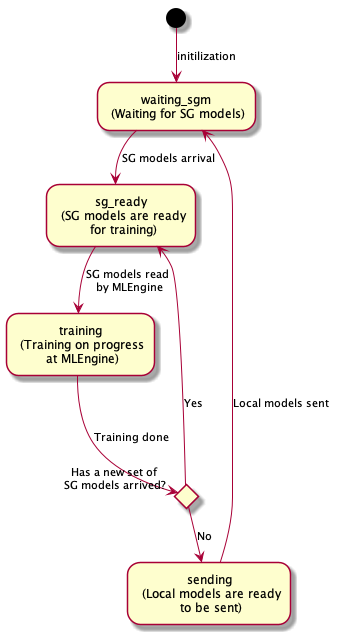
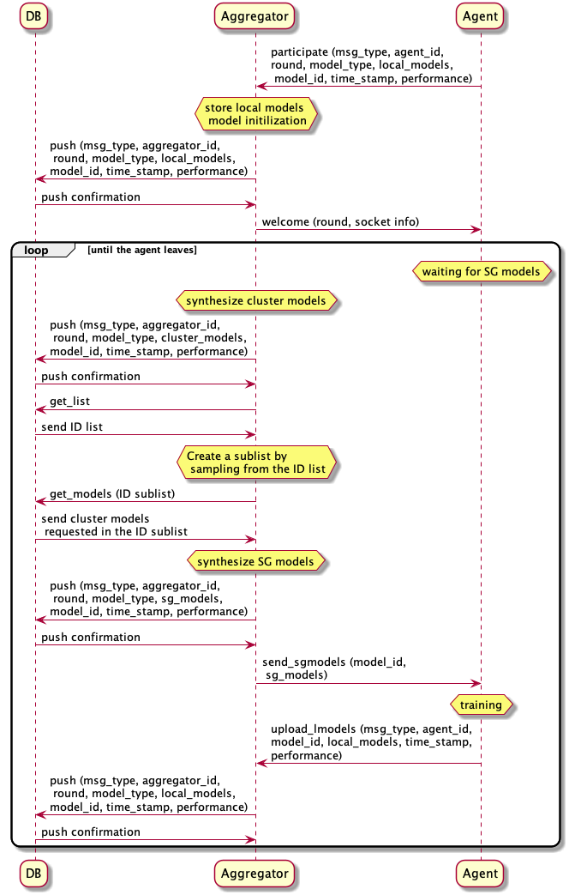

Documentation
=============

STADLE Component Specifications
-------------------------------

**Agent**

At the agent side, it is expected that two independent processes, which communicate each other through local files, are running.

.. image:: ../_static/agent_state.png

**Client (Communication handler)**

Note that this portion is written based on the ``Client2.py`` implementation.

* The initialization brings an agent to the ``waiting_sgm`` state where the agent waits for the semi-global models (base models) for training. This change is conducted by the ``Client`` module. While being in this state, the agent will pause its training.
* The arrival of the semi-global models from an aggregator changes the agent's state to ``sg_ready``. This change is conducted by the ``Client`` module. The state is communicated to ``MLEngine`` through a local ``state`` file. At the same time, the semi-global models are saved as a binary local file. The file names and local paths can be configured through the ``config.jason`` file. Please read the config file documentation.
* While being in the ``sg_ready`` and ``training`` states, ``Client`` waits for potential arrival of semi-global models. This scenario happens when its local training was too slow and the aggregator decided to aggregate other local models to create a new set of semi-global models.
  * If the new models arrives, ``Client`` changes the agent's state to ``sg_ready`` to let MLEngine to discard the current training results.
  * If not, ``Client`` waits for ``MLEngine`` finishing its training.
* The end of training is indicated by the ``sending`` state set by ``MLEngine``. Once the ``Client`` observes the state transition, it sends the trained local models stored as a binary file. After sending, it goes back to the ``waiting_sgm`` state.

**MLEngine (ML logic interface)**

Note that this portion is written based on the ``minimal_MLEngine.py`` implementation.

* When the state transits to ``sg_ready``, the ``MLEngine`` notices it reading the local ``state`` file.
* Once the ``MLEngine`` loads the semi-global models, it changes the agent's state to ``training`` and start local training, using the semi-global models as the base models. The state transition is communicated to ``Client`` through the ``state`` file.
* When the training is done, the ``MLEngine`` first checks the ``state`` file.
  * If the ``state`` file still indicates ``training``, it saves the trained local models as a binary file and changes the state to ``sending``.
  * If the ``state`` file was updated to ``sg_ready``, it discards the trained local models and goes back to the ``sg_ready`` state. This results in another ``training`` phase at the ``MLEngine``. This scenario happens when its local training was too slow and the aggregator decided to aggregate other local models to create a new set of semi-global models. The ``MLEngine`` needs to ignore the previous round of training. It may require the reduction of training time by reducing the training cycles or batch sizes.

**Aggregator**

**aggregation (Computational logic)**

``Aggregator`` contains some methods related to the aggregation computation and cluster model sampling. Please refer code documents for details.

**server_th (Communication handler)**
``Server`` provides a set of communication channels to exchange models with agents and access database. Please refer code documents for details.

**state_manager (State maintenance)**
All volatile states of an agent are stored under this ``Manager``. Please refer code documents for details. The following is the brief explanation about the data structure to store models.

Model Buffers

Two model buffers are maintained to temporarily stores models sent to an aggregator.

* ``local_model_buffers``: Buffers to store local models sent from agents. Each entry is in a shape of a dictionary entry: ``'model_name' : list of local models of model_name``. The key (``'model_name'``) needs to be picked from the pre-agreed list of model names. Please refer ``LimitedDict`` specification below.
* ``cluster_model_buffers``: Buffers to store cluster models pulled from database. These models are used to synthesize semi-global models. Each entry is in a shape of a dictionary entry: ``'model_name' : list of cluster models of model_name``. The key (``'model_name'``) needs to be picked from the pre-agreed list of model names. Please refer ``LimitedDict`` specification below.

Models
Two types of synthesized models are always kept in this module.

* ``cluster_models``: A dictionary of the synthesized cluster models. Each entry is in a shape of a dictionary entry: ``'model_name' : [cluster model of model_name]``. The key (``'model_name'``) needs to be picked from the pre-agreed list of model names.
* ``semi_global_models``: A dictionary of the synthesized semi-global models. Each entry is in a shape of a dictionary entry: ``'model_name' : [semi-global model of model_name]``. The key (``'model_name'``) needs to be picked from the pre-agreed list of model names.

Note that an extra attention is needed to extract a model from these model variables because of the data structure. A model of ``model_name`` can be extracted by the following, since the value in the dictionary is a list. This structure is adopted to keep the consistency with the buffers above.

.. code-block:: python

   cluster_models['model_name'][0]
   semi_global_models['model_name'][0]

When sending these models, the dictionary is converted so that its entry will be a shape of 'model_name' : model of model_name (The value is a model itself not a list.) for convenience at the agent and database side.

**Other Data Structure**

**LimitedDict**

A ``LimitedDict`` instance is instantiated give a list of model names. When adding an entry is attempted with a model name that is not defined in the initially given list, it refuses the addition.

.. code-block:: python

   name_list = ['name1', 'name2']
   d = LimitedDict[name_list]

.. _config file documentation: https://github.com/tie-set/stadle_dev/tree/master/docs/_src

STADLE Communication Protocols
------------------------------

**Aggregator-Agent (AGG-AGNT)**

**participate Message**

* An agent knows the IP address and port number to join the STADLE platform through the ``config.json`` file.
* When joining the platform, an agent sends a ``participate`` message that contains its ``id``, ``models``, ``init_flag``, ``simulation_flag``, and ``exch_socket``.
  * ``models``: A dictionary of models keyed by the model names agreed on ``config.json``. The weights of models need not to be trained if ``init_flag`` is ``False``, since it is only used by an aggregator to remember the shapes of models.
  * ``init_flag``: A boolean flag to indicate if the sent model weights should be used as a base model. If it is ``True`` and there is no semi-global models ready, an aggregator sets this set of local models as the first semi-global models and send it to all agents.
  * ``simulation_flag``: ``True`` if it is a simulation run.
  * ``exch_socket``: Port number waiting for SG models from the aggregator.

**welcome Message**

* Receiving the ``participation`` message, an aggregator returns a ``welcome`` message containing ``round``, ``socket info``.
  * ``round``: A natural number that indicates the current aggregation round of the aggregator.
  * ``socket info``: Socket numbers for the agent to prepare for the future communications with the aggregator.
* An agent uses the socket information to transit to a state waiting for semi-global models.

**send_sgmodels Message**

* An aggregator sends a set of semi-global models to each agent under it with ``send_sgmodels`` messages. It contains binary representation of the dictionary of the semi-global models.
* Upon the arrival of the message, an agent starts a new round of local training after setting the semi-global models as its base models.

**upload_lmodels Message**

* After a local training phase, an agent uploads the trained local models to the aggregator via a ``upload_lmodels`` message. It contains binary representation of the dictionary of the local models.
* After sending the local models, the agent goes back to a state waiting for a new semi-global model and pauses its training.
* The aggregator stores the uploaded local models in its buffers and waits for another round of cluster model aggregation until enough number of local models are uploaded by agents.

**Database-Aggregator (DB-AGG)**

All communications between an aggregator and database are initiated by the aggregator.

**push Message**

* An aggregator send its cluster models by a ``push`` message. This message contains binary representation of a model dictionary and the cluster ID.
* Receiving the message, database stores the pair of ``(cluster id, model dictionary)`` in its storage.
* Database returns a confirmation message. Currently, this confirmation is not used at the aggregator.

**get_list Message**

* To prepare a set of cluster models for the semi-global model synthesis, an aggregator sends a ``get_list`` message.
* Database responds to it by returning a list of cluster IDs to which the database stores cluster models corresponding

**get_models Message**

* An aggregator decides, by sampling, a set of cluster models that it wants to pull for the semi-global model synthesis.
* The selected ID list is communicated by a ``get_models`` message.
* Database sends back a set of cluster models specified by the sublist of IDs in the ``get_models`` message.

STADLE Code Documentation

.. _STADLE Code Documentation: https://tie-set.github.io/stadle_dev/html/
