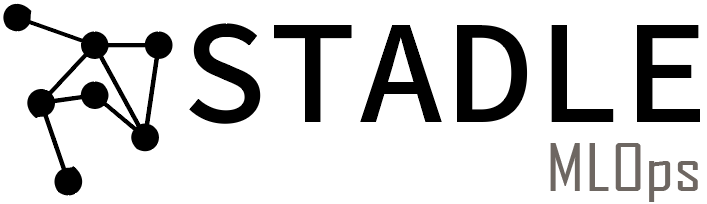

Quick Start
===========
testing

Installation
=============

Using STADLE
============

Server
------

::
    For macOS:
    conda env create -n stadleenv -f ./setups/stadleenv.yaml
    For Linux:
    conda env create -n stadleenv -f ./setups/stadleenv_linux.yaml

Note: The environment has ``Python 3.7.4.`` There is some known issues of 
``ipfshttpclient`` with ``Python 3.7.2 and older``.

User (Agent) Device
-------------------

::
  
    For macOS:
    conda env create -n stadleenv -f ./setups/stadleenv.yaml
    For Linux:
    conda env create -n stadleenv -f ./setups/stadleenv_linux.yaml

Database Device
---------------

::
  
    For macOS:
    conda env create -n stadleenv -f ./setups/stadleenv.yaml
    For Linux:
    conda env create -n stadleenv -f ./setups/stadleenv_linux.yaml

Registration
************

.. toctree::
   :maxdepth: 3
   :caption: Contents:
   
   overview
   GUI
   release_notes
   guides
   tech_support
   tables
   template
