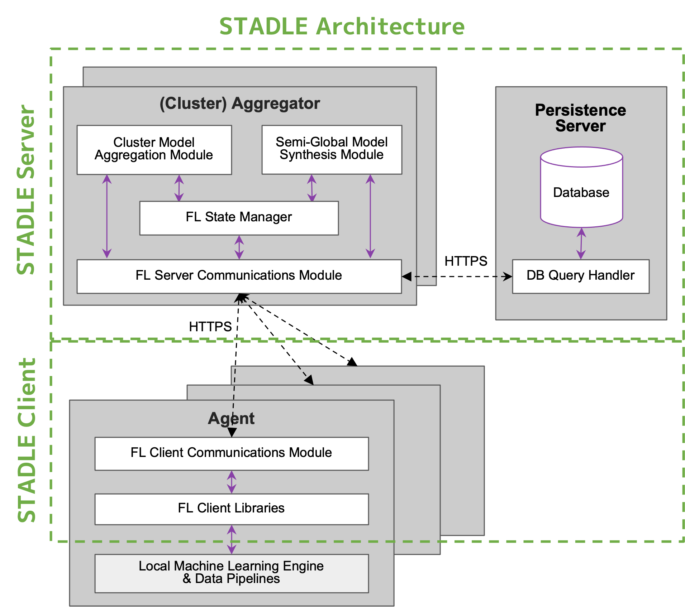
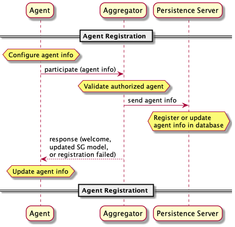
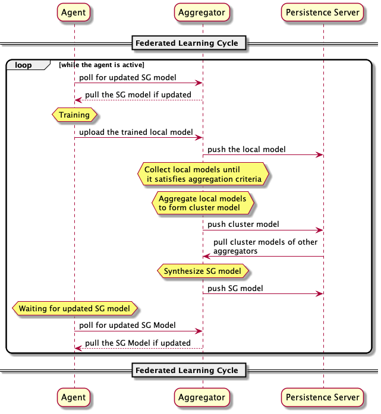

Overview
========

Introduction to STADLE
***********************

Our STADLE is a paradigm-shifting intelligence centric platform for federated, collaborative, and continuous learning.
STADLE stands for Scalable Traceable Adaptive Distributed Learning platform.

In particular, Federated learning, the core capability of STADLE, continuously collects Machine Learning models from distributed devices or clients,
aggregates the collective intelligence, and bring it back to the local devices.
Therefore, Federated Learning (FL) using our STADLE solves the fundamental problems that commonly appear in ML systems such as

- **Privacy**: FL does not require users to upload raw data to cloud servers, thus it improves the privacy-preserving aspect of AI systems by not collecting personal or sensitive data in the cloud.
- **Real-Time Intelligence**: It often takes a lot of time to deliver desired intelligence, and sometimes all the value is gone by the time it is delivered. FL usually does not have to create huge data pipeline and set up conputational resources to deliver high-quality intelligence.
- **Communication Load**: The amount of traffic generated by FL dramatically decreases from classical AI systems due to the difference in data type exchanged.
- **Low Latency**: The delay in communication to obtain collective intelligence can be dramatically reduced by employing decentralized FL servers located at edge servers.

Our STADLE platform is horizontally designed and enhances the capability of FL.

- **Scalability**: Decentralized FL servers in STADLE realizes the load-balancing to accommodate more users and create semi-global models which does not require a central master aggregator node.
- **Traceability**: Our platform has the performance tracking capability that monitors and manages the transition of collective intelligence models in the decentralized system.
- **Adaptability**: Static intelligence procduced by big data systems gets outdated and underperform easily while the adaptive intelligence is created by a well designed distributd resilient learning framework that perfectly sync up the local and global models.

STADLE Architecture
*********************

There are 3 main components in STADLE.

- Persistence Server

  - A core functionality which helps in keeping track of various database entries.
  - Packaged as a command inside `stadle` library.
  - `stadle persistence-server [args]`

- (Cluster) Aggregator

  - A core FL server functionality that conducts aggregation process.
  - Packaged as a command inside `stadle` library.
  - `stadle aggregator [args]`

- Agent

  - A core functionality and libraries that help integrating the local ML engine and/or models into the STADLE platform.
  - In charge of communicating with `stadle` core functions.
  - Packaged inside `stadle` library as a class.
  - `from stadle import BasicClient / IntegratedClient`
  - `class BasicClient / IntegratedClient` is used to integrate training, testing, validation functions of the local ML process.

All those components are connected using WebSockets and exchange machine learning models with each other.

STADLE Initialization 
*************************************

Components Registration
------------------------
Overall registration sequence of aggregators and agents with a database is described in Figure about Process of aggregator and agent registration in database server. The sequence is quite simple. The initialization and registration process always needs to happen in the order of database, aggregator, and agents.

Initial Model Upload Process by Admin Agent
--------------------------------------------
Next step of running a federated learning process is to register the initial ML model whose architecture will be used in the entire and continuous process of FL by all the aggregators and agents. We call the initial ML model used as a reference to model aggregation as a “base model”. Also, we call the agent that uploads the initial base model an “admin agent”. That being said, the process of initializing the base model can be seen in the Figure about Admin agent’s base model upload process. The base model info could include the ML model itself as well as the time it was generated, the initial performance data, etc.

.. image:: ../_static/initial_model_reg_simple.png

Federated Learning Cycle with STADLE
*************************************

Figure below is Overview of the federated learning process showing the overall process of how federated learning is continuously conducted between an aggregator and an agent typically. Here it only describes a single-agent case, but in real case and operation, the agent environments are many and dispersed into distributed devices. 

The agents other than the admin agent will request the global model that is an updated federated ML model in order to deploy it to its own application. 

Once the agent gets the updated model from the aggregator and deploys it, the agent basically retrains the ML model locally with new data that is obtained afterwards. Again, these local data will not be shared with the aggregator and stay local within the distributed devices. 

After retraining the local ML model (that of course has the same architecture as the global/base model of the federated learning), the agent calls FL client API to send the model to the aggregator.

Aggregator receives the model and pushes the model to the database. The aggregator keeps track of the number of collected ML models and it will keep accepting the local ML models as long as the federation round is open. The round can be closed with any defined criteria such as the aggregator receiving enough ML models to be federated. When the criteria are met, the aggregator aggregates the ML model and produces an updated global model that is ready to be sent back to the agent.

During that process above, agents constantly keep polling to the aggregator if the global model is realy or not. Or in some cases, the aggregator may push the global model to the agents that are connected to the aggregator depending on the design and network constraints. Then, the updated model is sent back to the agent.

After receiving the updated global model, the agent deploys and retrains it whenever that is ready and repeats this process until the termination criteria are met for the federated learning. In many cases, there are no termination conditions to stop this federated learning and retraining process.

Client-Side Local Training Cycle
*********************************

Figure below is the state transition of an agnet for local ML training.

(1) The agent queries the aggregator for updates to the global model (a.k.a. ML model exchanged between the aggregator and agent). Basically, a polling method is used to query the updated global model every seconds/minutes/hours/days. However, in some specific settings, an aggregator could push the updated global model to all agents.
(2) If available, the agent downloads the federated global model that has been updated by the aggregator. These parameters can be kept-read only, but attempted changes to them during training are cached. 
(3) The agent feeds the downloaded global model to its ML model. Before completely replacing the local ML model with the downloaded model, the agent can calculate an output and store the new input and the feedback from the process. 
(4) The agent can proceed with the local (re)training process. During the training of the model, an additional optimization objective could be added for the prediction error for the process variables. The model is trained to optimize its performance and process variable prediction objectives. Interpretability of this process is discussed below.
(5) Updates to be made to the ML model that is cached so it can be sent to the aggregator when a new update to the local model is ready. Then, agent sends back its updated local ML model to an aggregator.

.. image:: ../_static/spec_agent.png

Ready to get started? Great! Click here for :ref:`Installation` steps.
